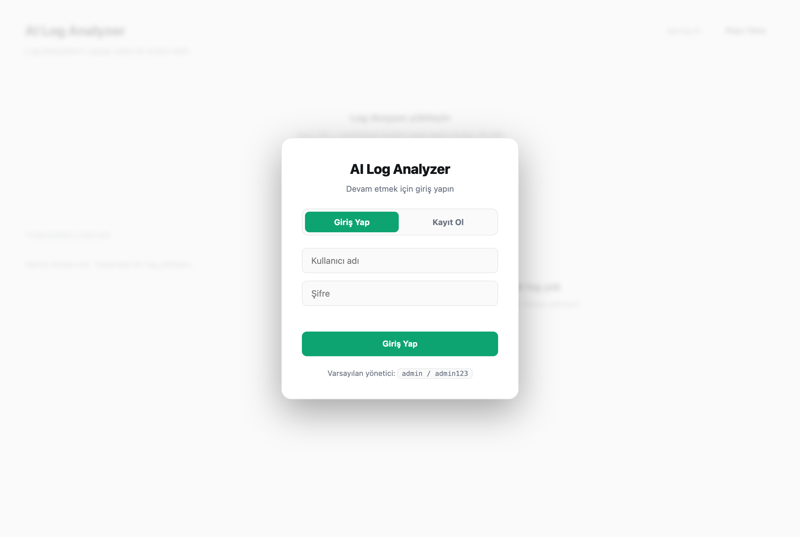
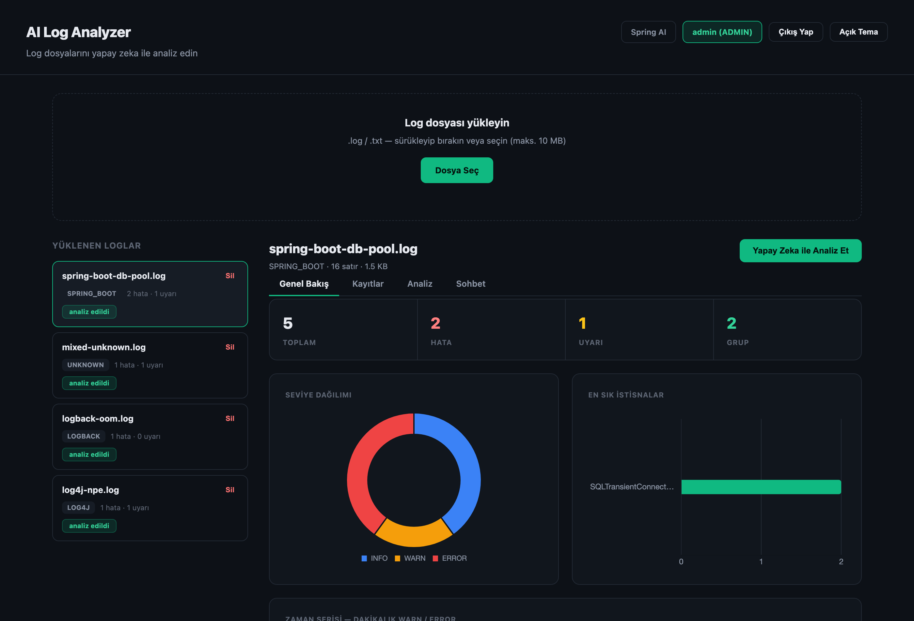
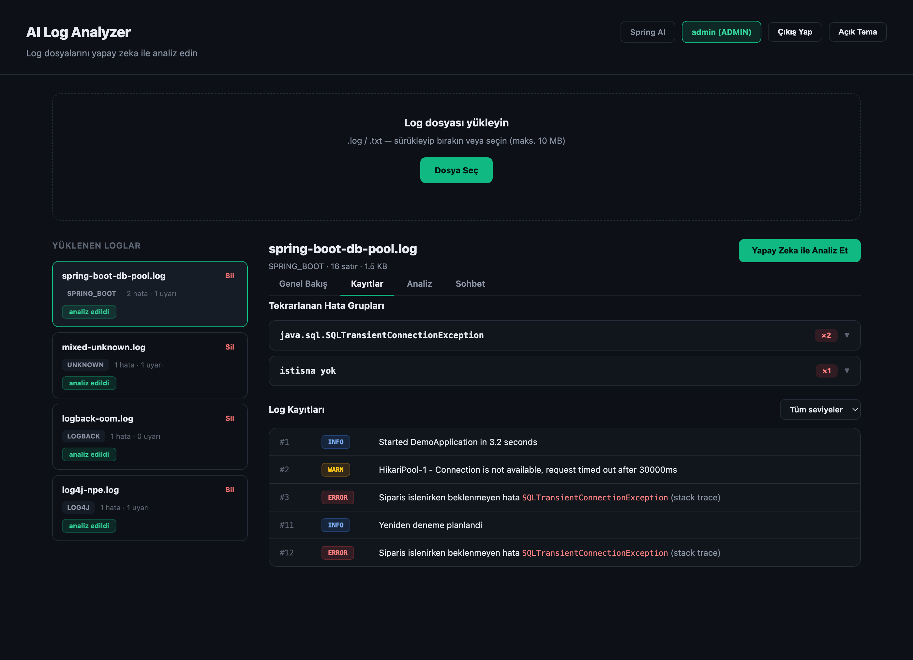
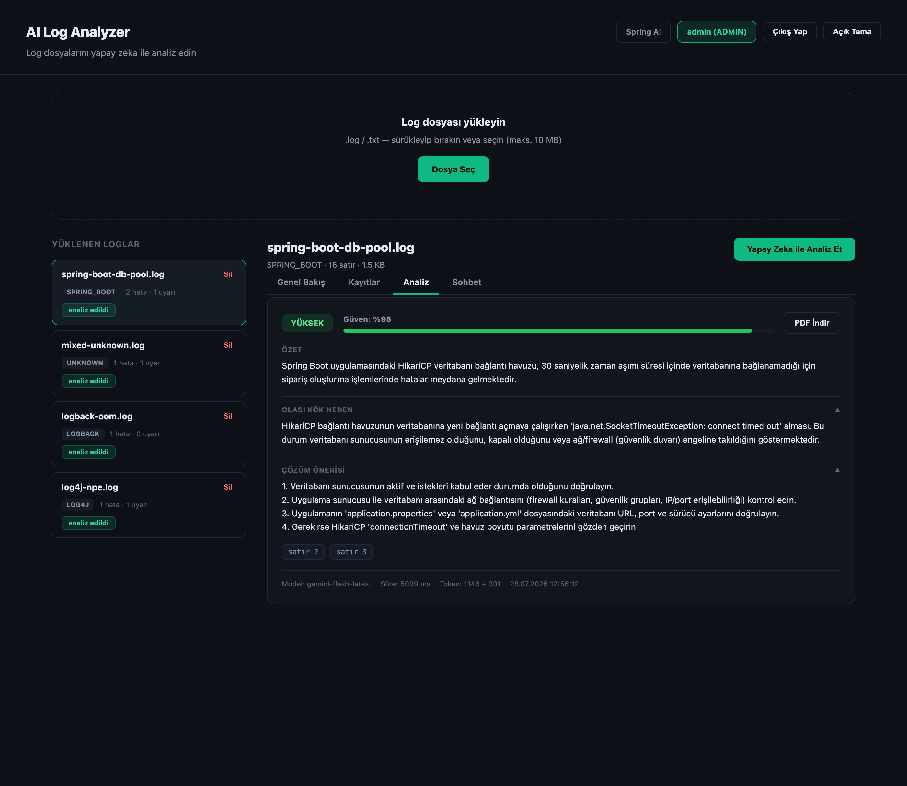
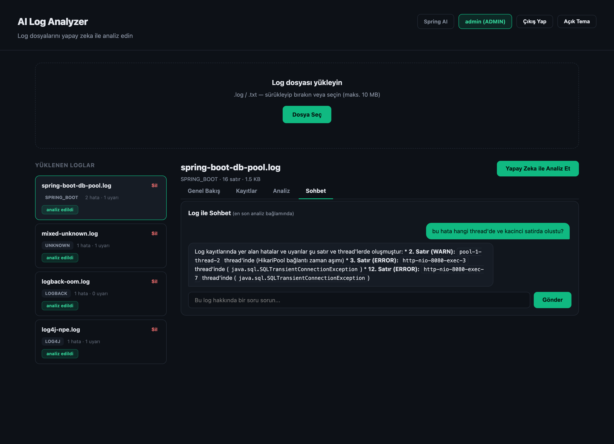
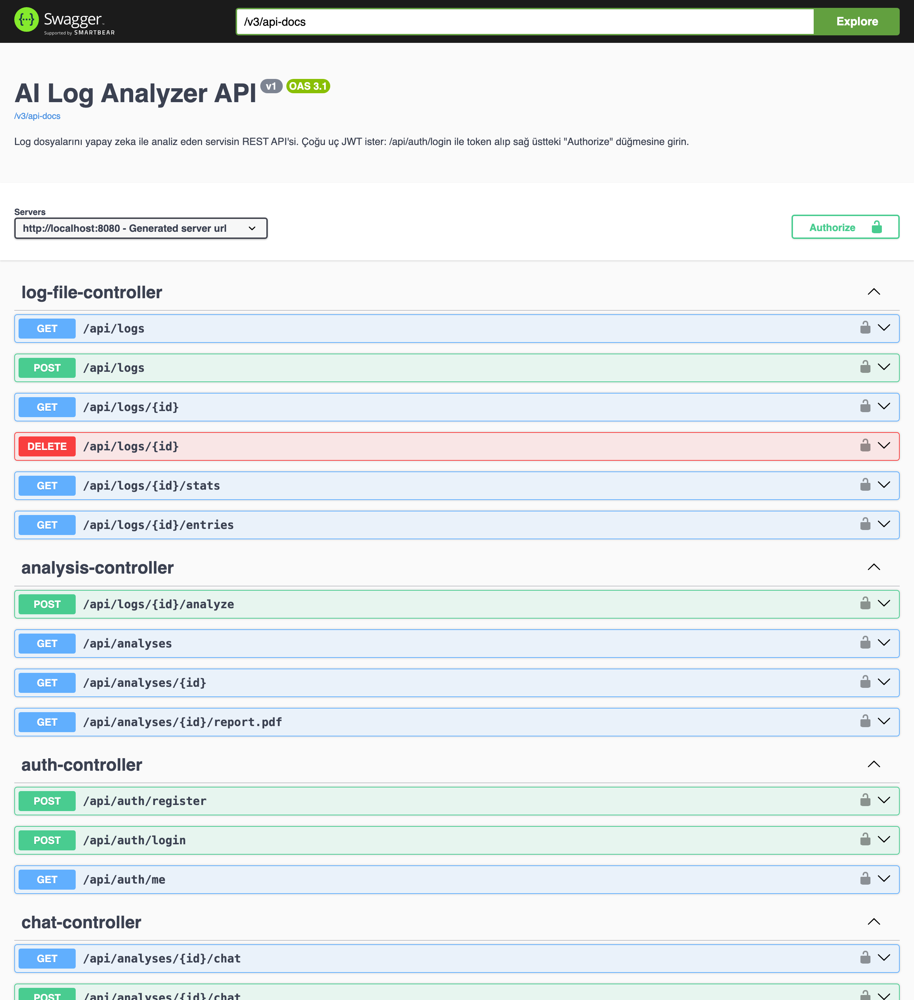

# AI Log Analyzer

Log dosyalarını (Spring Boot / Log4j / Logback) yükleyip **yapay zeka (Google Gemini)** ile analiz eden,
hata kök nedenini/çözümünü öneren, dashboard'da görselleştiren ve log ile serbest sohbet edilebilen
çok kullanıcılı bir web uygulaması.



## İçindekiler

- [Özellikler](#özellikler)
- [Mimari Özeti](#mimari-özeti)
- [Hızlı Başlangıç (Docker)](#hızlı-başlangıç-docker)
- [Alternatif: Elle Çalıştırma](#alternatif-elle-çalıştırma)
- [Ekran Görüntüleri](#ekran-görüntüleri)
- [API Uçları](#api-uçları)
- [Örnek Loglar](#örnek-loglar)
- [Test](#test)
- [Proje Yapısı](#proje-yapısı)

## Özellikler

- **Log yükleme + parse:** Spring Boot / Log4j / Logback formatlarını otomatik algılar, çok satırlı stack trace'leri birleştirir, bilinmeyen formatlarda dürüstçe "parse edilemedi" sayar.
- **Damıtma + hata gruplama:** Ham log AI'a asla gönderilmez — tekrarlanan hatalar parmak izine göre gruplanır (Sentry-vari), istatistikler + WARN→ERROR geçiş tespiti çıkarılır.
- **Yapay zeka analizi (Gemini):** Özet, kök neden, çözüm önerisi, öncelik (CRITICAL/HIGH/MEDIUM/LOW), 0-1 güven seviyesi ve kanıt satırı numaraları — yapılandırılmış (structured) çıktı olarak.
- **Log ile sohbet:** Analiz + WARN/ERROR seviyesindeki gerçek kayıtlar (satır no, thread, mesaj) bağlamında serbest metin soru-cevap; konuşma geçmişi hatırlanır.
- **Dashboard:** Seviye dağılımı, en sık istisnalar, dakikalık WARN/ERROR zaman serisi (Chart.js).
- **PDF rapor:** Analiz sonucunu Türkçe karakter destekli PDF olarak indirme.
- **Kimlik doğrulama + roller:** JWT tabanlı login/kayıt; her kullanıcı yalnızca kendi yüklediği logları görür/analiz eder/siler, **ADMIN** rolü tüm kullanıcıların loglarını denetleyebilir.
- **Tek komutla demo:** `mock` AI profili ile API anahtarı olmadan da tüm akış (login hariç hiçbir şey kısıtlanmadan) denenebilir.

## Mimari Özeti

```
Yükleme → Parse (format algıla + kayıtlara böl) → Gruplama (fingerprint, tekrarlanan hata tespiti)
        → İstatistik (seviye dağılımı, zaman serisi, WARN→ERROR geçişi)
        → Damıtılmış bağlam (istatistik + en önemli hata grupları, ~200 satır) → Gemini → Analiz sonucu
```

- **Backend:** Java 21, Spring Boot 3.4.7, Spring Data JPA, Flyway (şemanın tek doğruluk kaynağı), PostgreSQL, Spring Security + JWT, Spring AI (OpenAI-uyumlu istemci → Gemini), springdoc-openapi.
- **Frontend:** Bağımlılıksız (framework'süz) vanilla JS + CSS, Spring Boot tarafından statik olarak sunulur; Chart.js tek yerel bağımlılık.
- **Katmanlar:** `controller` (HTTP) → `service`/`service.impl` (iş mantığı, arayüzlere bağımlı — DIP) → `repository` (Spring Data) → `domain` (JPA entity). `parse`/`distill`/`ai`/`security` paketleri kendi sorumluluklarına ayrılmış bağımsız modüller.
- Tam mimari/tasarım kararları ve gün gün gerekçeler için bkz. [`PLAN.md`](PLAN.md).

## Hızlı Başlangıç (Docker)

Gerekli: Docker + Docker Compose. **Java veya Maven kurulu olmasına gerek yok.**

```bash
git clone https://github.com/ensaaryaman/ai-log-analyzer.git
cd ai-log-analyzer
cp .env.example .env
# .env içine GEMINI_API_KEY'inizi yazın (https://aistudio.google.com/apikey → ücretsiz)

docker compose up --build
```

Birkaç saniye sonra:
- **Uygulama:** http://localhost:8080
- **Swagger UI:** http://localhost:8080/swagger-ui/index.html
- **Varsayılan giriş:** `admin` / `admin123` (ilk girişten sonra şifreyi değiştirin — taze bir veritabanında otomatik oluşturulur)

**API anahtarınız yoksa** bile `mock` profiliyle tüm akışı (login, yükleme, dashboard, sohbet — yalnızca AI yanıtı sahte) gezebilirsiniz:

```bash
SPRING_PROFILES_ACTIVE=mock docker compose up --build
```

Durdurmak için `docker compose down` (verileri de silmek isterseniz `-v` ekleyin).

## Alternatif: Elle Çalıştırma

Geliştirme için (Java 21 + PostgreSQL gerekir):

```bash
docker compose up -d postgres      # yalnızca veritabanını ayağa kaldır
./mvnw spring-boot:run              # uygulamayı elle çalıştır (varsayılan profil = gerçek AI)
```

`.env` dosyası `spring-dotenv` ile otomatik yüklenir.

## Ekran Görüntüleri

| Dashboard (Genel Bakış) | Kayıtlar (hata grupları + tablo) |
|---|---|
|  |  |

| Analiz (Gemini sonucu) | Log ile Sohbet |
|---|---|
|  |  |

| Swagger UI |
|---|
|  |

## API Uçları

Tüm uçların canlı, denenebilir belgesi: **`/swagger-ui/index.html`** (JWT ile "Authorize" düğmesi çalışır).

### Kimlik doğrulama (`/api/auth`) — `register`/`login` herkese açık, diğerleri token ister

| Metot | Yol | Açıklama |
|---|---|---|
| POST | `/api/auth/register` | Yeni kullanıcı oluşturur (rol: USER), token döner |
| POST | `/api/auth/login` | Kullanıcı adı+şifre doğrular, JWT döner |
| GET | `/api/auth/me` | Aktif (token sahibi) kullanıcı bilgisi |

### Log dosyaları (`/api/logs`) — hepsi token ister; sahiplik filtreli (USER kendi, ADMIN tümü)

| Metot | Yol | Açıklama |
|---|---|---|
| POST | `/api/logs` | Log dosyası yükler (multipart), parse eder, özet döner |
| GET | `/api/logs` | Yüklenen dosyaları listeler |
| GET | `/api/logs/{id}` | Tek bir dosyanın özeti |
| GET | `/api/logs/{id}/entries?level=` | Parse edilmiş kayıtlar (seviye filtresi opsiyonel) |
| GET | `/api/logs/{id}/stats` | Damıtılmış istatistikler (dashboard verisi) |
| DELETE | `/api/logs/{id}` | Dosyayı ve bağlı tüm verileri siler |

### Analiz (`/api/logs/{id}/analyze`, `/api/analyses`)

| Metot | Yol | Açıklama |
|---|---|---|
| POST | `/api/logs/{id}/analyze` | Yapay zeka analizini başlatır |
| GET | `/api/analyses?fileId=` | Analiz geçmişi (opsiyonel dosya filtresi) |
| GET | `/api/analyses/{id}` | Tek bir analiz sonucu |
| GET | `/api/analyses/{id}/report.pdf` | Analizi PDF rapor olarak indirir |

### Sohbet (`/api/analyses/{id}/chat`)

| Metot | Yol | Açıklama |
|---|---|---|
| POST | `/api/analyses/{id}/chat` | Analiz bağlamında soru sorar (`{"question": "..."}`) |
| GET | `/api/analyses/{id}/chat` | Sohbet geçmişi |

## Örnek Loglar

`samples/` altında 4 senaryolu örnek log dosyası bulunur:

| Dosya | Senaryo |
|---|---|
| `spring-boot-db-pool.log` | HikariCP bağlantı havuzu tükenmesi (DB bağlantı fırtınası) |
| `log4j-npe.log` | NullPointerException, Log4j formatı |
| `logback-oom.log` | OutOfMemoryError, Logback formatı |
| `mixed-unknown.log` | Bilinmeyen/karışık format — parse dürüstlüğü testi |

`samples/outputs/` altında bu dört log için **gerçek Gemini analiz çıktıları** (JSON) örnek olarak bulunur.

## Test

```bash
./mvnw test        # birim testler (Docker gerekmez), 87 test
./mvnw verify       # + entegrasyon testleri (Testcontainers/Docker gerektirir)
```

Test stratejisi: parser uç durumları, fingerprint/gruplama, AI servis testleri (mock istemci ile — gerçek API çağrısı asla otomatik teste girmez), yetkilendirme testleri (401/403, sahiplik). Detay için [`PLAN.md`](PLAN.md) Bölüm 10.

## Proje Yapısı

```
src/main/java/com/ailoganalyzer/
├── controller/    REST uçları (yalnızca HTTP ile ilgilenir)
├── service/       İş mantığı arayüzleri + service.impl uygulamaları
├── repository/     Spring Data JPA repository'leri
├── domain/         JPA entity'leri + enum'lar
├── dto/            İstemciye dönen değişmez veri taşıyıcıları
├── parse/          Saf log parse motoru (I/O yok, test edilebilir)
├── distill/        Fingerprint/damıtma (AI'a gitmeden önceki özetleme)
├── ai/              Spring AI istemcileri (gerçek + mock, profile göre)
├── security/       JWT servisi, filtre, SecurityConfig, yetkilendirme kontrolü
├── config/         @ConfigurationProperties, OpenAPI, admin seed
└── exception/       Özel istisnalar + RFC 7807 ProblemDetail handler
```

Şemanın tek doğruluk kaynağı `src/main/resources/db/migration/` altındaki Flyway migration'larıdır (Hibernate yalnızca doğrulama yapar, şema üretmez).
